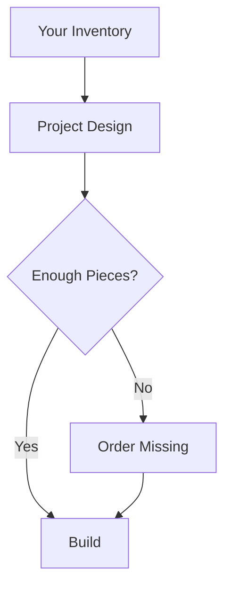

## Overview

Yellow DirkShark lets you manage your LEGO collection, build custom projects, and access shared designs. Start by tracking your physical pieces, then use them to create or follow digital instructions. This page covers the core ideas to get you building confidently.

<Callout kind="info">
  Familiarize yourself with these concepts before diving into projects.
</Callout>

## Key Concepts

Discover the building blocks of Yellow DirkShark through these foundational elements.

<Columns cols={3}>
  <Card title="Piece Inventories" icon="database" href="#piece-inventories">
    Track your physical LEGO pieces and check availability for builds.
  </Card>
  <Card title="Custom Projects" icon="cube" href="#custom-projects">
    Design and assemble models using your inventory.
  </Card>
  <Card title="Design Libraries" icon="library" href="#design-libraries">
    Browse and follow community instructions.
  </Card>
</Columns>

## Piece Inventories

Manage your personal LEGO piece inventories to see what you can build. Upload or sync your collection via CSV import or manual entry. Each inventory lists pieces by ID, color, and quantity.

Use the API to query your inventory:

<CodeGroup tabs="JavaScript,Python">
  ```javascript
  const response = await fetch('https://api.example.com/v1/inventories/me', {
    headers: { Authorization: `Bearer ${YOUR_API_KEY}` }
  });
  const inventory = await response.json();
  console.log(inventory.pieces); // Array of { id, color, quantity }
  ```
  ```python
  import requests
  response = requests.get(
    'https://api.example.com/v1/inventories/me',
    headers={'Authorization': f'Bearer {YOUR_API_KEY}'}
  )
  inventory = response.json()
  print(inventory['pieces'])  # List of dicts: {'id': '123', 'color': 'red', 'quantity': 5}
  ```
</CodeGroup>

<Steps>
  <Step title="Add Pieces" icon="plus">
    Navigate to your profile and select `Add to Inventory`.

    ```bash
    curl -X POST https://api.example.com/v1/inventories/me/pieces \
      -H "Authorization: Bearer YOUR_API_KEY" \
      -d '{"piece_id": "973pb123", "color_id": 1, "quantity": 4}'
    ```
  </Step>
  <Step title="Sync Collection" icon="refresh-cw">
    Import from Rebrickable or scan boxes for bulk updates.
  </Step>
  <Step title="Verify Availability" icon="check-circle">
    Check pieces needed for a project against your stock.
  </Step>
</Steps>

## Custom Projects

Define projects as digital blueprints using MLCAD files or in-app editors. Link them to your inventory to simulate builds and order missing pieces.



<ParamField path="project_id" param-type="string" required="true">
  Unique project identifier.
</ParamField>

<ParamField body="name" param-type="string">
  Project title, e.g., "Custom Millennium Falcon".
</ParamField>

<ParamField body="pieces" param-type="array">
  List of required `{piece_id}`, `{color_id}`, `{quantity}`.
</ParamField>

## Design Libraries

Navigate the vast library of user-generated instructions and designs. Filter by theme, difficulty, or piece requirements. Download MIs or view step-by-step builds.

<Tabs>
  <Tab title="Browsing" icon="search">
    Use filters to find designs matching your inventory.

    <Expandable title="Advanced Filters" default-open="true">
      Combine themes like `Star Wars` with max pieces `<500`.
    </Expandable>
  </Tab>
  <Tab title="Following Instructions" icon="book-open">
    Load a design and follow interactive steps.

    <Image
      src="https://example.com/instruction-screenshot.png"
      alt="Interactive instruction viewer showing step 3 of a LEGO build"
      width="800"
      height="450"
    />
  </Tab>
</Tabs>

<Callout kind="tip">
  Save designs to your library for offline access and quick builds.
</Callout>

These concepts form the backbone of Yellow DirkShark. Master your inventory first, then experiment with projects and explore shared designs to unlock endless creativity.