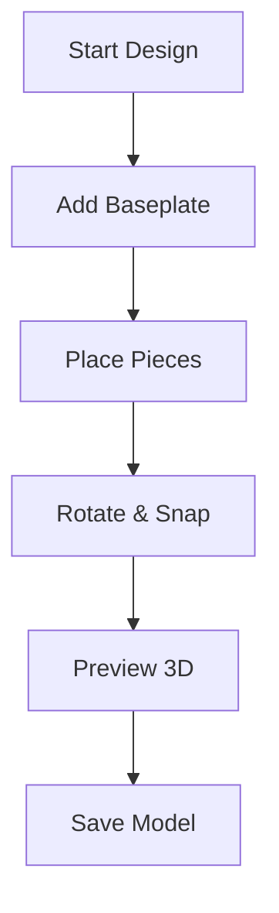

## Key Features

Yellow DirkShark empowers you to explore a vast library of LEGO projects, design your own custom models, and share them with a global community. Use advanced search tools to find inspiration based on your collection, assemble virtual builds step-by-step, and upload your creations for feedback and collaboration.

<Columns cols={3}>
  <Card title="Search & Filter" icon="search" href="#searching">
    Discover projects matching your themes or pieces.
  </Card>
  <Card title="Design Models" icon="edit-3" href="#designing">
    Build custom LEGO creations virtually.
  </Card>
  <Card title="Share Creations" icon="share-2" href="#sharing">
    Upload and collaborate with the community.
  </Card>
</Columns>

## Searching and Filtering Projects

Find the perfect LEGO project using powerful search and filter options. Start by entering keywords, then refine by theme, piece count, or your personal collection.

<Tabs>
  <Tab title="By Theme" icon="tag">
    Select from popular themes like `Star Wars` or `City`.

    <Steps>
      <Step title="Enter Theme" icon="search">
        Type your theme in the search bar, e.g., `Pirates`.
      </Step>
      <Step title="Apply Filters" icon="sliders">
        Filter by difficulty: `Beginner`, `Intermediate`, `Advanced`.
      </Step>
      <Step title="Browse Results" icon="list">
        Sort by popularity or newest first.
      </Step>
    </Steps>
  </Tab>
  <Tab title="By Pieces" icon="package">
    Match projects to your existing bricks.

    <Steps>
      <Step title="Scan Collection" icon="camera">
        Upload your inventory or link `https://inventory.example.com`.
      </Step>
      <Step title="Filter Matches" icon="filter">
        Show builds using `<100` pieces from your set.
      </Step>
      <Step title="Save Favorites" icon="bookmark">
        Add to your library for later.
      </Step>
    </Steps>
  </Tab>
</Tabs>

<Callout kind="tip">
  Pro tip: Combine filters for precise results, like `Space` theme with `>50` pieces.
</Callout>

## Designing Custom Models

Create original LEGO designs with the intuitive builder tool. Drag and drop pieces, follow step-by-step assembly, and preview in 3D.



<Steps>
  <Step title="New Project" icon="plus">
    Click `New Build` and select plate size.
  </Step>
  <Step title="Assemble Step-by-Step" icon="layers">
````json
{
  "step1": ["1x1 brick red", "2x4 plate blue"],
  "step2": ["add wheels", "connect axles"]
}
````
    Use the parts palette to build layers.
  </Step>
  <Step title="Validate & Export" icon="check-circle">
    Check stability, then export MOC file.
  </Step>
</Steps>

<CodeGroup tabs="JSON,CSV">
```json
{
  "model": {
    "name": "Custom Car",
    "pieces": [
      {"id": "3001", "color": "red", "quantity": 4},
      {"id": "3024", "color": "black", "quantity": 2}
    ]
  }
}
```
```csv
id,color,quantity
3001,red,4
3024,black,2
```
</CodeGroup>

## Uploading and Sharing Creations

Once your model is ready, share it with the community to get feedback and inspire others.

<Expandable title="Upload Process" default-open="true">
  <Steps>
    <Step title="Prepare Files" icon="upload">
      Gather images, instructions, and piece list.
    </Step>
    <Step title="Submit" icon="send">
      Use the `Upload` button and add tags like `vehicles`, `advanced`.
    </Step>
    <Step title="Community Review" icon="users">
      Respond to comments and iterate.
    </Step>
  </Steps>
</Expandable>

<Callout kind="success">
  Shared projects gain visibility—tag accurately for better discoverability.
</Callout>

<Columns cols={2}>
  <Card title="Get Feedback" icon="message-circle" href="#sharing">
    Engage with builders worldwide.
  </Card>
  <Card title="Next: Quickstart" icon="rocket" href="/quickstart">
    Build your first project now.
  </Card>
</Columns>